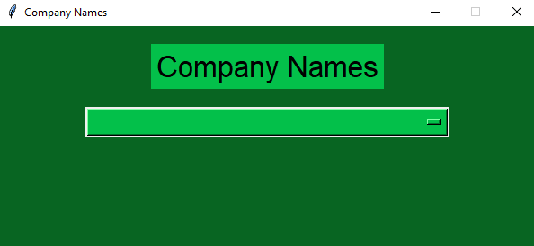

# Big Data Purification 

*A python script for big data purification of a sqlite3 database.*

This repository contains code that cleans big data (company names) from the
semos_company_names.db database.

## Description
* The script main.py presents the big data purification in two ways - with and without
the multiprocessing library. It also shows the time needed to complete each step of 
the purification, as well as the total time.

## Contact
Author
* Kristina Jovanovska (kristina.jovanovska@protonmail.com)

## Table of Contents 
* Requirements
* Data 
* How to use this code 
* Use your own database

## Requirements
For this script you need the following libraries and modules:

1. sqlite3 ([documentation](https://docs.python.org/3/library/sqlite3.html))
2. pandas ([documentation](https://pandas.pydata.org/docs/user_guide/index.html) \, [installation](https://pandas.pydata.org/docs/getting_started/install.html))
3. re ([documentation](https://docs.python.org/3/library/re.html))
4. multiprocessing ([documentation](https://docs.python.org/3/library/multiprocessing.html) \,  [pip_install](https://pypi.org/project/multiprocessing/))
5. tkinter ([documentation](https://docs.python.org/3/library/tk.html))
6. time ([documentation](https://docs.python.org/3/library/time.html))

## Database
The semos_company_names.db has one table: 3 columns
(id, name, company_name_cleaned), 20 000 rows.

## How to use this code 
1. To purify the big data \
   \
     1.1. without the multiprocessing library - in `main.py` 
     uncomment only the following lines
     ```
     ccn = CleanCompanyNames()
     ccn.no_multiprocessing()
     ```
    1.2. with the multiprocessing library - in `main.py`
     uncomment only the following lines
     ```
     ccn = CleanCompanyNames()
     ccn.with_multiprocessing()
     ```

   
2. To print the rows from the table companies\
   \
   In `main.py` uncomment only the following lines 
   ```
   yr = YieldRows()
   for row in yr.yield_row():
       print(row)
   ```
   
3. To see company cleaned names in ascending order, in tkinter gui\
   \
  In `main.py` uncomment only the following lines 
   ```
   app = MyApp()
   app.mainloop()
   ```
   

## Use your own database
1. Change the database name, table name and column names
to your own sqlite3 database name, table name and column names.
2. Use the replace() method for any additional occurrences
of substrings that need to be replaced.
3. In the method pd.read_sql() change the chunksize 
appropriate to the number of rows in your table. 